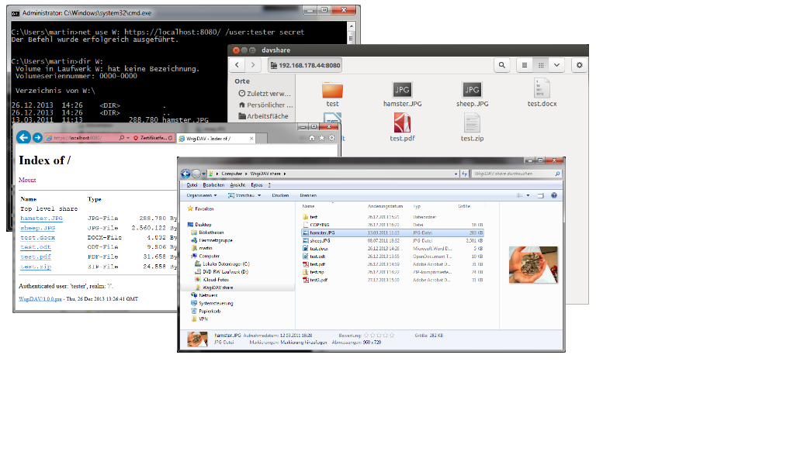

.. _main-index:

############################
|logo| WsgiDAV Documentation
############################

A generic and extendable `WebDAV <http://www.ietf.org/rfc/rfc4918.txt>`_ server
written in Python and based on `WSGI <http://www.python.org/dev/peps/pep-0333/>`_.

:Project:   https://github.com/mar10/wsgidav/
:Version:   |version|, Date: |today|

|travis_badge| |nbsp| |pypi_badge| |nbsp| |lic_badge| |nbsp| |rtd_badge|

.. toctree::
   :hidden:

   Overview<self>
   installation
   user_guide.md
   reference_guide
   development
   changes

Main Features
=============

- Comes bundled with a server and a file system provider, so we can share a
  directory right away from the command line.
- Designed to run behind any WSGI compliant server.
- Tested with different clients on different platforms (Windows, Linux, Mac).
- Supports online editing of MS Office documents.
- Contains a simple web browser interface.
- SSL support
- Support for authentication using Basic or Digest scheme.
- Passes the `litmus test suite <http://www.webdav.org/neon/litmus/>`_.
- Open architecture allows to `write custom providers <user_guide_custom_providers>`_
  (i.e. storage, locking, authentication, virtual file systems, ...).
- WsgiDAV is a `refactored version of PyFileServer <https://github.com/mar10/wsgidav/blob/master/doc/changelog04.md>`_
  written by Ho Chun Wei.

Quickstart
==========

Releases are hosted on `PyPI <https://pypi.python.org/pypi/WsgiDAV>`_.
Install WsgiDAV (and a server) like::

	$ pip install cheroot wsgidav

To serve the ``/tmp`` folder as WebDAV ``/`` share, simply run::

	$ wsgidav --host=0.0.0.0 --port=80 --root=/tmp

.. note::
   MS Windows users that only need the command line interface may prefer the
   `MSI installer <https://github.com/mar10/wsgidav/releases>`_.

Supported Clients
=================

WsgiDAV comes with a web interface and was tested with different clients
(Windows File Explorer and drive mapping, MS Office, Ubuntu, Mac OS X, ...).

..
  .. seealso::
  	:doc:`run-access`

.. |travis_badge| image:: https://travis-ci.org/mar10/wsgidav.svg?branch=master
   :alt: Build Status
   :target: https://travis-ci.org/mar10/wsgidav

.. |pypi_badge| image:: https://img.shields.io/pypi/v/wsgidav.svg
   :alt: PyPI Version
   :target: https://pypi.python.org/pypi/wsgidav/

.. |lic_badge| image:: https://img.shields.io/pypi/l/wsgidav.svg
   :alt: License
   :target: https://github.com/mar10/wsgidav/blob/master/LICENSE

.. |rtd_badge| image:: https://readthedocs.org/projects/wsgidav/badge/?version=latest
   :target: http://wsgidav.readthedocs.io/
   :alt: Documentation Status
