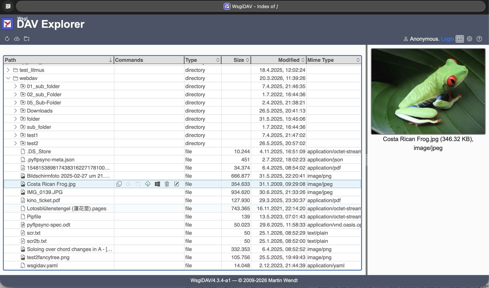
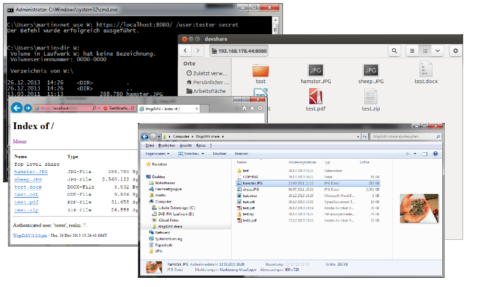

.. _main-index:

############################
|logo| WsgiDAV Documentation
############################

A generic and extendable `WebDAV <http://www.ietf.org/rfc/rfc4918.txt>`_ server
written in Python and based on `WSGI <http://www.python.org/dev/peps/pep-3333/>`_.

:Project:   https://github.com/mar10/wsgidav/
:Version:   |version|, Date: |today|

|gh_badge| |nbsp| |pypi_badge| |nbsp| |lic_badge| |nbsp| |rtd_badge|

.. toctree::
   :hidden:

   Overview<self>
   installation
   user_guide
   reference_guide
   development
   changes

Main Features
=============

- Comes bundled with a server and a file system provider, so we can share a
  directory right away from the command line.
- Designed to run behind any WSGI compliant server.
- Tested with different clients on different platforms (Windows, Linux, macOS).
- Supports online editing of MS Office documents.
- Contains a simple web browser interface.
- SSL support
- Support for authentication using Basic or Digest scheme.
- Passes the `litmus test suite <http://www.webdav.org/neon/litmus/>`_.
- Open architecture allows to :doc:`user_guide_custom_providers`
  (i.e. storage, locking, authentication, virtual file systems, ...).

DAV Explorer
------------
WsgiDAV comes with a slick web interface that allows to explore the DAV share and 
perform basic operations (create, delete, move, copy, rename, ...) directly
in the browser, without the need for additional software or drive mapping. |br|
Up- and downloading of files is supported using drag-and-drop or file dialogs. |br|
Also inline editing of office documents is supported when MS Office or LibreOffice is 
installed on the client machine.

.. note::

  DAV Explorer is available since version 4.4. |br|
  It has beta status and is not enabled by default, but must be explicitly enabled 
  in the configuration file ``wsgidav.yaml``.

Supported Clients
-----------------

WsgiDAV comes with a web interface and was tested with different clients
(Windows File Explorer, macOS Finder, MS Office, LibreOffice, ...).

..
  .. seealso::
  	:doc:`run-access`

Quickstart
==========

Releases are hosted on `PyPI <https://pypi.python.org/pypi/WsgiDAV>`_.
Install WsgiDAV (and a server) like::

  $ pip install cheroot wsgidav

.. note::
   MS Windows users that only need the command line interface may prefer the
   `MSI installer <https://github.com/mar10/wsgidav/releases>`_ or install
   using the Windows Package Manager::

     > winget install wsgidav

To serve the ``/tmp`` folder as WebDAV ``/`` share with anonymous read-write
access, simply run::

  $ wsgidav --host=0.0.0.0 --port=80 --root=/tmp --auth=anonymous

Then open `http://HOST/ <http://localhost/>`_ in your browser or pass this URL to another
WebDAV-aware client, such as MS Word, macOS Finder, Windows File Explorer, ...

**On Linux** we can enforce authentication against known users (e.g.
``/etc/passwd``, ``/etc/shadow``) like so::

  $ wsgidav --host=0.0.0.0 --port=80 --root=/tmp --auth=pam-login

**On Windows** we can enforce authentication against known users (e.g.
Windows Domain Controller) like so::

  > wsgidav --host=0.0.0.0 --port=80 --root=/tmp --auth=nt

There is much more to configure. Read this docs to find out.

**Docker**
An experimental Docker image that exposes a local directory using WebDAV
is available here: https://hub.docker.com/r/mar10/wsgidav/

::

    $ docker pull mar10/wsgidav
    $ docker run --rm -it -p <PORT>:8080 -v <ROOT_FOLDER>:/public/wsgidav-share mar10/wsgidav

for example::

    $ docker run --rm -it -p 8080:8080 -v c:/temp:/public/wsgidav-share mar10/wsgidav

If you want to use a custom configuration file, mount it like this::

     $ docker run --rm -it -v c:/path/to/wsgidav.yaml:/path/to/wsgidav.yaml mar10/wsgidav

.. |gh_badge| image:: https://github.com/mar10/wsgidav/actions/workflows/tests.yml/badge.svg
   :alt: Build Status
   :target: https://github.com/mar10/wsgidav/actions/workflows/tests.yml

.. |pypi_badge| image:: https://img.shields.io/pypi/v/wsgidav.svg
   :alt: PyPI Version
   :target: https://pypi.python.org/pypi/wsgidav/

.. |lic_badge| image:: https://img.shields.io/pypi/l/wsgidav.svg
   :alt: License
   :target: https://github.com/mar10/wsgidav/blob/master/LICENSE

.. |rtd_badge| image:: https://readthedocs.org/projects/wsgidav/badge/?version=latest
   :target: https://wsgidav.readthedocs.io/
   :alt: Documentation Status
