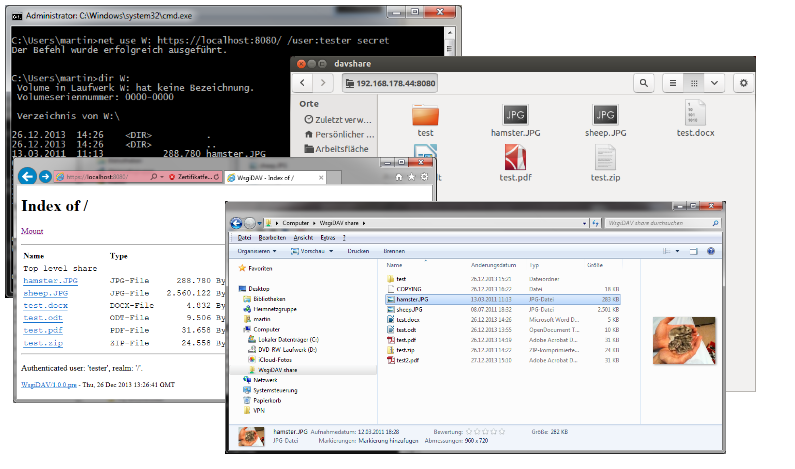

==============
WebDAV Clients
==============

*This section describes, how a WsgiDAV server can be accessed with different
clients.*

WsgiDAV was tested with these clients

  * Windows 7, 8, 10
  * Windows Vista (Microsoft-WebDAV-!MiniRedir/6.0.6002)
  * Window XP (Microsoft-WebDAV-!MiniRedir/5.1.2600)
  * DAVExplorer
  * Microsoft® Office 2013
  * OpenOffice 3.1
  * Ubuntu Nautilus / gvfs
  * Mac OS/X Finder

The following examples assume, that we have a running WsgiDAV server on a remote
machine with this configuration:

  * Server is running on a machine with IP address 192.168.0.2
  * Server is listening on port 80
  * A user called 'tester' with password 'secret' is configured to have access.
    (Or the share allows anonymous access.)

.. toctree::
   :maxdepth: 1

Windows clients
===============
Redirector
----------
The easiest way to access a WebDAV share from a Windows client is probably
to map it as a network drive, and then use the File Explorer.

If the share allows anonymous access, type this at the command prompt::

    > net use W: http://192.168.0.2/
    > dir W:

For access controlled shares, we must provide a user name::

    > net use W: http://192.168.0.2/ /USER:tester

Windows will then prompt for a password. Alternatively we can pass password with
the command line::

    > net use W: http://192.168.0.2/ /USER:tester secret

To make this connection persistent between reboots::

    > net use W: http://192.168.0.2/ /USER:tester secret /PERSISTENT:YES

To stop a connection::

    > net use W: /DELETE

.. note::
   Some known quirks of Windows redirector are listed below.

**Known issues on all Windows versions**

* See also greenbytes `WebDAV Mini-Redirector (MRXDAV.SYS) Versions and Issues
  List <http://greenbytes.de/tech/webdav/webdav-redirector-list.html>`_.

* The WebDAV server must respond to PROPFIND and OPTIONS requests at the root
  share ('/'). So when running behind another web server, WsgiDAV must be
  mounted at top level.

* Digest authentication is supported by default.
  Basic authentication is disabled, when HTTP is used instead of SSL/HTTPS.
  (This can be changed by editing the registry: http://support.microsoft.com/kb/841215)

  Basic authentication sends passwords unencrypted, so it is generally a good
  thing to do this only over an SSL encrypted channel.

  Problems may arise, when we cannot provide Digest authentication (maybe
  because a custom WsgiDAV domain controller has no access to the users
  passwords).
  Or when our server does not provide HTTPS support.

**Additional issues on Windows 7**

* By default Basic authentication is only allowed, when SSL (HTTPS) is used.
  (See previous notes.)

* Reportedly on Windows 7, WebDAV requests receive a 3 second delay in the
  Windows explorer.
  To fix this, you may change IE's proxy settings::

    Open IE -> Go to Tools menu -> Internet Options -> Connections
    -> LAN settings -> Un-check Automatically detect settings
    -> Click Ok -> Click Ok

**Additional issues on Windows Vista:**

* By default Basic authentication is only allowed, when SSL (HTTPS) is used.
  (See previous notes.)

**Additional issues on Windows XP:**

* Windows XP cannot map '/' shares, so we have to connect to an existing
  sub folder (for example `/dav`)::

    > net use W: http://192.168.0.2/dav

* No custom port is accepted in the URL, like `http://192.168.0.2:8001/dav`.
  So WsgiDAV must run on port 80.
  This also means, that SSL won't work (This may help: http://www.stunnel.org/).

* The URL must start with `http://`. HTTPS is not supported.

  This in turn means that we have to enable Digest authentication, because
  Basic authentication is not allowed over HTTP (see common Windows issues
  above).

  However at least on SP3 the redirector seems to follow `302 Redirect`
  responses to a https location. And then Basic authentication worked.

* There have been problems reported, when the ``NET USE`` command prompts you
  for a name/password. (Servicepack 3 seems to work fine.)
  In this case, try to pass username and password on the command line with the
  ``/USER`` option::

    > net use W: http://192.168.0.2/dav /USER:tester secret

WebFolders
----------
Microsoft's "WebFolder" client predates Windows XP's WebDAV Redirector.

* TODO

.. note::
   Some known quirks of Microsoft's "WebFolder" client are listed below.

   See also greenbytes `Web Folder Client (MSDAIPP.DLL) Versions and Issues List
   <http://greenbytes.de/tech/webdav/webfolder-client-list.html>`_.

* If you experience problems, you might try Microsoft's
  `Software Update for Web Folders <http://www.microsoft.com/downloads/details.aspx?FamilyId=17C36612-632E-4C04-9382-987622ED1D64>`_

Linux clients
=============
Nautilus / gvfs
---------------
From the Nautilus File menu choose 'Connect to server...'. In the dialog box enter

  * Service type: 'WebDAV (HTTP)'
  * Server: '192.168.0.2'
  * Folder: 'ro_docs' or whatever the share name is (leave empty for root share).
  * Port: the port number (leave empty for default port 80)
  * User Name: leave this empty: do *not* enter anything here.

Then click 'Connect' and enter username and password.

**Known issues:**

* When copying directories, only an HTML file is created at the target.
  See http://bugzilla.gnome.org/show_bug.cgi?id=605619

davfs2
------
On Ubuntu we can mount a WebDAV file system.
First make sure, that davfs2 is installed::

    $ sudo apt-get install davfs2

Then create the mount point::

    $ sudo mkdir /mnt/wsgidav_temp
    $ sudo chmod 0766 /mnt/wsgidav_temp
    $ sudo mount -t davfs http://192.168.0.2/dav /mnt/wsgidav -o rw
    Please enter the username to authenticate with server
    http://192.168.0.2/dav or hit enter for none.
    Username: tester
    Please enter the password to authenticate user tester with server
    http://192.168.0.2/dav or hit enter for none.
    Password:

To unmount::

    sudo unmount /mnt/wsgidav

Mac
===
OS/X Finder
-----------
In the Finder menu, choose `Go` and `Connect to Server...`.

 1. Enter the URI of the WsgiDAV server: `http://192.168.0.2/dav`
 1. Click the `[+]` button behind it to keep the server URI.
 1. Click the `[Connect]` button at the bottom.
 1. Enter credentials and click `[Connect]`
 1. Browse, search, and so on.  The volume is on the desktop.

Browser clients
===============
WsgiDAV enables HTTP browsing by default, so it is always possible to enter::

    http://192.168.0.2/dav

in the address bar of your favorite web browser.
